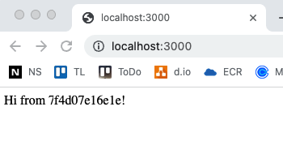

# nodejs_on_oke
Deploying NodeJS on top of OKE


1. Install on dev host NVM:

```shell
curl -o- https://raw.githubusercontent.com/creationix/nvm/v0.39.1/install.sh | bash
```

2. With NVM installed, install nodejs

```shell 
nvm install node
```

3. Clone the empty repo and then initialize it with 

```shell
npm init -y
```

4. Install express as a dependency

```shell
npm install express
```

5. Create an index.js file that contains something like this: 

```js
const express = require('express')
const os = require('os')

const app = express()
app.get('/', (req, res) => {
        res.send(`Hi from ${os.hostname()}!`)
})

const port = 3000
app.listen(port, () => console.log(`listening on port ${port}`))
```

6. Create `Dockerfile` that looks like this: 

```dockerfile
FROM node:13-alpine

WORKDIR /app
COPY package.json package-lock.json ./
RUN npm install --production
COPY . .
EXPOSE 3000
CMD node index.js
```

7. Create a `docker-compose.yaml` file that looks like this:

```yaml
version: "3.3"
services: 
  nodejs:
    build: 
      context: .
      dockerfile: Dockerfile
    image: nodejs:latest
    ports:
      - 3000:3000
```

8. Build the image with `docker-compose`

```shell
$ docker-compose up --build
Creating network "nodejsonoke_default" with the default driver
Building nodejs
Step 1/7 : FROM node:13-alpine
Trying to pull repository docker.io/library/node ... 
13-alpine: Pulling from docker.io/library/node
cbdbe7a5bc2a: Pull complete
780514bed1ad: Pull complete
5d74fb112a7d: Pull complete
4b9536424fa1: Pull complete
Digest: sha256:527c70f74817f6f6b5853588c28de33459178ab72421f1fb7b63a281ab670258
Status: Downloaded newer image for node:13-alpine
 ---> 8216bf4583a5
Step 2/7 : WORKDIR /app
 ---> Running in e6a7523c1057
Removing intermediate container e6a7523c1057
 ---> 4e9a68ccafbb
Step 3/7 : COPY package.json package-lock.json ./
 ---> f2511db640ec
Step 4/7 : RUN npm install --production
 ---> Running in 2cc33aa3d507
npm WARN read-shrinkwrap This version of npm is compatible with lockfileVersion@1, but package-lock.json was generated for lockfileVersion@2. I'll try to do my best with it!
added 50 packages from 37 contributors and audited 50 packages in 1.266s

2 packages are looking for funding
  run `npm fund` for details

found 0 vulnerabilities

Removing intermediate container 2cc33aa3d507
 ---> d7b42376127b
Step 5/7 : COPY . .
 ---> c5ab7f8e5801
Step 6/7 : EXPOSE 3000
 ---> Running in f2a723ee667c
Removing intermediate container f2a723ee667c
 ---> ab3406ae3608
Step 7/7 : CMD node index.js
 ---> Running in eaa11865d5d6
Removing intermediate container eaa11865d5d6
 ---> 1d28f67f9598

Successfully built 1d28f67f9598
Successfully tagged nodejs:latest
Creating nodejsonoke_nodejs_1 ... done
Attaching to nodejsonoke_nodejs_1
nodejs_1  | listening on port 3000
```

9. Test the by accessing `http://localhost:3000`




10. Build the kubernetes orchestration


